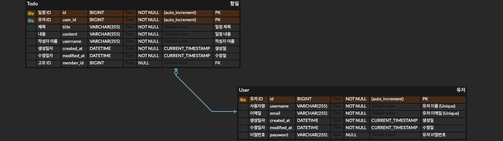

# 🗓️ Spring_day_Project
***
☀️ Spring Day - CH 3 일정 관리 앱 Develop
## 📔 목차 
***
- 🔍 Project 소개
- 🚀 주요 기능
- 🪛 개발 환경
- 🧾 API 명세서
- 📝 ERD
***


## 🔍 Project 소개

#### **Spring_day_Project**는 Spring Boot 기반의 일정 관리 웹 애플리케이션입니다.  
#### 사용자는 일정 등록, 조회, 수정, 삭제 등 CRUD 기능을 수행할 수 있으며,  
#### 회원가입 및 로그인 기능으로 개인화된 일정 관리를 제공합니다.  
#### 또한 Postman을 통한 API 테스트 및 명세서 문서를 제공합니다.

[](https://documenter.getpostman.com/view/44800736/2sB2qcBL7j)


## 🚀 주요 기능
- 일정 CRUD: 일정 등록, 조회, 수정, 삭제
- 사용자 CRUD: 회원가입, 조회, 수정, 삭제
- 비밀번호 필드를 활용해 회원가입
- 로그인/인증: 세션과 쿠키 기반 인증, 필터를 활용한 인증 처리


## 🛠️ 사용 기술 스택
-  ☕️ Languages  : `Java`
-  ✏️ JDK : `Oracle OpenJDK 17.0.5`
- ⚙️ framework : `Spring Boot 3.4.5`, `Spring Data JPA`
- 🗄️ DB : `MySQL`
- 🛠️ IDE : `IntelliJ IDEA`


## 🧾 API 명세서
- 일정 API

| 기능 | HTTP 메서드 | URL | 설명 |
| --- | --- | --- | --- |
| 일정 등록 | POST | /todos | 일정 등록 |
| 전체 조회 | GET | /todos | 전체 일정 목록 조회 |
| 단건 조회 | GET | /todos/{id} | 단건 일정 조회 |
| 일정 수정 | PUT | /todos/{id} | 특정 일정 수정 |
| 일정 삭제 | DELETE | /todos/{id} | 특정 일정 삭제 |

<details>
  <summary>일정 등록</summary>

## 개요

- **URL**: `/todos`
- **Method**: `POST`
- **설명**: 일정을 등록하는 API입니다.

### 요청 (Request)

- Params: 없음
- Body (JSON):

```json
{
  "title": "팀 프로젝트 준비",
  "content": "팀 프로젝트 회의 자료 준비 및 발표 연습",
  "username": "홍길동",
  "memberId": 123
}
```

### 성공 응답 (Response)

- Status: `201 Created`

```json
{
  "id": 1,
  "title": "팀 프로젝트 준비",
  "content": "팀 프로젝트 회의 자료 준비 및 발표 연습",
  "memberId": 123,
  "username": "홍길동",
  "createdAt": "yyyy-mm-dd",
  "modifiedAt": "yyyy-mm-dd"
}
```

### 실패 응답

- Status: `400 Bad Request` 

```json
{
  "error": "title은 필수 항목입니다."
}
```
</details>
<details>
  <summary>전체 조회</summary>

## 개요

- **URL**: `/todos`
- **Method**: `GET`
- **설명**: 모든 일정을 조회하는 API입니다.

### 요청 (Request)

- Params: 없음
- Body: 없음

### 성공 응답 (Response)

- Status: `200 OK`

```json
[
  {
    "id": 1,
    "title": "팀 프로젝트 준비",
    "content": "팀 프로젝트 회의 자료 준비 및 발표 연습",
    "username": "홍길동",
    "memberId": 123,
    "createdAt": "yyyy-mm-dd",
    "modifiedAt": "yyyy-mm-dd"
  },
  {
    "id": 2,
    "title": "개인프로젝트 준비",
    "content": "개인 프로젝트 회의 자료 준비 및 발표 연습",
    "username": "심청이",
    "memberId": 1234,
    "createdAt": "yyyy-mm-dd",
    "modifiedAt": "yyyy-mm-dd"
  }
]
```
</details>
<details>
  <summary>단건 조회</summary>

## 개요

- **URL**: `/todos/{id}`
- **Method**: `GET`
- **설명**: 단건 일정을 조회하는 API입니다.

### 요청 (Request)

- Params: `id` (Path Variable)
- Body: 없음

### 성공 응답 (Response)

- Status: `200 OK`

```json
{
  "id": 1,
  "title": "팀 프로젝트 준비",
  "content": "팀 프로젝트 회의 자료 준비 및 발표 연습",
  "username": "홍길동",
  "memberId": 123,
  "createdAt": "yyyy-mm-dd",
  "modifiedAt": "yyyy-mm-dd"
}
```

### 실패 응답

- Status: `404 Not Found`

```json
{
  "error": "해당 일정이 존재하지 않습니다."
}
```
</details>
<details>
  <summary>일정 수정</summary>

## 개요

- **URL**: `/todos/{id}`
- **Method**: `PUT`
- **설명**: 특정 일정을 수정하는 API입니다.

### 요청 (Request)

- Params: `id` (Path Variable)
- Body (JSON):

```json
{
  "title": "팀 프로젝트 준비 - 계획 변경",
  "content": "팀 프로젝트 회의 자료 발표 시작으로 변경",
  "memberId": 123
}
```

### 성공 응답 (Response)

- Status: `200 OK`

```json
{
  "id": 1,
  "title": "팀 프로젝트 준비 - 계획 변경",
  "content": "팀 프로젝트 회의 자료 발표 시작으로 변경",
  "username": "홍길동",
  "memberId": 123,
  "createdAt": "yyyy-mm-dd",
  "modifiedAt": "yyyy-mm-dd"
}
```

### 실패 응답

- Status: `404 Not Found`

```json
{
  "error": "수정하려는 일정이 존재하지 않습니다."
}
```
</details>
<details>
  <summary>일정 삭제</summary>

## 개요

- **URL**: `/todos/{id}`
- **Method**: `DELETE`
- **설명**: 특정 일정을 삭제하는 API입니다.

### 요청 (Request)

- Params: `id` (Path Variable)
- Body: 없음

### 성공 응답 (Response)

- Status: `200 OK`

```json
{
  "message": "삭제 완료"
}
```

### 실패 응답

- Status: `404 Not Found`

```json
{
  "error": "삭제하려는 일정이 존재하지 않습니다."
}
```
</details>

- 유저 API

| 기능 | HTTP 메서드 | URL | 설명 |
| --- | --- | --- | --- |
| 유저 등록 | POST | /users | 새로운 유저 생성 |
| 유저 전체 조회 | GET | /users | 전체 유저 목록 조회 |
| 유저 단건 조회 | GET | /users/{id} | 단건 유저 조회 |
| 유저 수정 | PUT | /users/{id} | 특정 유저 정보 수정 |
| 유저 삭제 | DELETE | /users/{id} | 특정 유저 삭제 |

<details>
  <summary>유저 등록</summary>

## 개요

URL: `/users`

Method: `POST`

설명: 유저를 생성하는 API입니다.

### 요청 (Request)

Params: 없음

Body (JSON):

```json
{
  "username": "john_doe",
  "email": "john.doe@example.com",
  "password": "password"
}
```

### 성공 응답 (Response)

- Status: `201 Created`

```json
{
  "id": 1,
  "username": "gil_dong",
  "email": "gildong@example.com",
  "createdAt": "yyyy-mm-dd",
  "modifiedAt": "yyyy-mm-dd"
}
```

### 실패 응답

- Status: `400 Bad Request` 

```json
{
  "error": "username은 필수 항목입니다."
}
```
</details>
<details>
  <summary>유저 전체 조회</summary>

## 개요

URL: `/users`

Method: `GET`

설명: 모든 유저를 조회하는 API입니다.

### 요청 (Request)

Params: 없음

Body: 없음

### 성공 응답 (Response)

Status: `200 OK`

```json
{
    "id": 1,
    "username": "gil_dong",
    "email": "gildong@example.com",
    "createdAt": "yyyy-mm-dd",
    "modifiedAt": "yyyy-mm-dd"
  },
  {
    "id": 2,
    "username": "simcheong@example.com",
    "email": "simcheong@example.com",
    "createdAt": "yyyy-mm-dd",
    "modifiedAt": "yyyy-mm-dd"
  }
```
</details>
<details>
  <summary>유저 단건 조회</summary>

## 개요

URL: `/users/{id}`

Method: `GET`

설명: 특정 유저를 단건 조회하는 API입니다.

### 요청 (Request)

Params: 없음

Body: 없음

### 성공 응답 (Response)

Status: `200 OK`

```json
{
  "id": 1,
  "username": "gil_dong",
  "email": "gildong@example.com",
  "createdAt": "yyyy-mm-dd",
  "modifiedAt": "yyyy-mm-dd"
}
```

### 실패 응답

Status: `404 Not Found`

```json
{
  "error": "해당 id의 유저를 찾을 수 없습니다."
}
```
</details>
<details>
  <summary>유저 수정</summary>

## 개요

URL: `/users/{id}`

Method: `PUT`

설명: 특정 유저를 수정하는 API입니다.

### 요청 (Request)

Params: 없음

Body (JSON):

```json
{
  "username": "gil_dong_updated",
  "email": "gildong.updated@example.com",
  "password": "password"
}
```

### 성공 응답 (Response)

Status: `200 OK`

```json
{
  "id": 1,
  "username": "gil_dong_updated",
  "email": "gildong.updated@example.com",
  "createdAt": "yyyy-mm-dd",
  "modifiedAt": "yyyy-mm-dd"
}
```

### 실패 응답

Status: `404 Not Found`

```json
{
  "error": "username은 필수 항목입니다."
}
```
</details>
<details>
  <summary>유저 삭제</summary>

## 개요

URL: `/users/{id}`

Method: `DELETE`

설명: 특정 유저를 삭제하는 API입니다.

### 요청 (Request)

Params: 없음

Body: 없음

### 성공 응답 (Response)

Status: `200 OK`

```json
{
  "message": "유저가 삭제되었습니다."
}
```

### 실패 응답

Status: `404 Not Found`

```json
{
  "error": "해당 id의 유저를 찾을 수 없습니다."
}
```

</details>


## 📝 ERD
